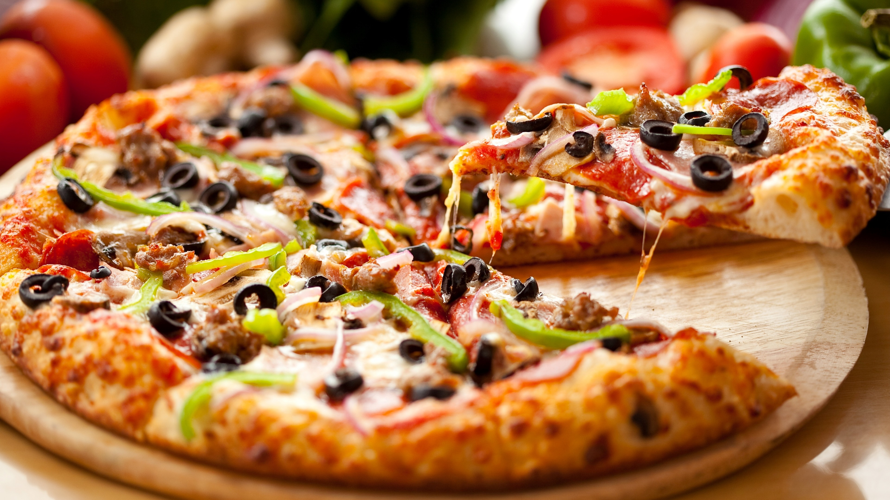

<html>
    <head>
        <title>UK ME</title>
        

        <link rel="stylesheet" href="PROJECT.css">
       

              <!--Import Google Icon Font-->
      <link href="https://fonts.googleapis.com/icon?family=Material+Icons" rel="stylesheet">
      <!--Import materialize.css-->
      <link type="text/css" rel="stylesheet" href="css/materialize.min.css"  media="screen,projection"/>
      <!--Let browser know website is optimized for mobile-->
      <meta name="viewport" content="width=device-width, initial-scale=1.0"/>

    
    </head>
    <body>
 <!--JavaScript at end of body for optimized loading-->
               

               <!-- Compiled and minified CSS -->
             <link rel="stylesheet" href="https://cdnjs.cloudflare.com/ajax/libs/materialize/1.0.0/css/materialize.min.css">
         <!-- Compiled and minified JavaScript -->
         

    

      
    

  

  
        
        
        
        

    <h2>LIMITED EDITION OFFER</h2>
    
    
<b>Prices have been reduced by 50% so get your favourite Pizza NOW!!!!</b>

    <h2> MENU</h2>

    Margherita pizza: £4.29 
    pepperoni Pizza: £4.45 
    vegan Pizza: £4.11 
    Chicken Pizza: £4.11 
    Cheese Pizza: £4.10 
    Veggie Pizza: £4.11 
    Meat Pizza: £4.39 
    Hawaiian Pizza: £4.25 
    Buffalo Pizza: £4.11 

 
  

  <h1><b>ALL ABOUT US</b></h1>
   
  We are A Group Of 6 Students Who Are Making a Pizza Box. <b>Not Just Any Regular Pizza Box</b> But The Ultimate Pizza Box.
  Our Goal is To make a Pizza Box to not just to stop you from getting Cheese stuck all over your pizza  Box but also to keep it warm 
  and tasty for you. Our Pizza Box will Also Have Layers in which you can but multiple pizzas in.
   
  If you want to know more Contact us AT  
  Email: UkMe@Gmailwe.com
   
Phone Number: 007700900138
 
After all Have A break, Have a Quality

    </body>
</html>
